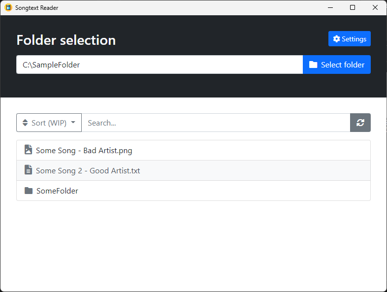

#  Songtext Reader

 

**Songtext Reader is an app to manage all your lyrics.**

## How it works
Songtext Reader displays all folders, text files and images in a selected directory.  
The idea is that you have all your lyric files in one directory and can view, manage and edit them in the app.  
Songtext Reader is like an explorer for lyric files, but with other useful features for lyric management.  

## Features
 - Manage all your lyric files
 - View your lyric files
 - Edit your lyric files
 - Quickly search for a specific lyric file
 - Sort your lyric files
 - Customize which file extensions are shown
 
## Upcoming features
 - **In-app editor** (Until now you can only view/edit lyrics in your favorite editor (e.g. Notepad, Notepad++, VS Code, ...))
 - **Fully customizable file extension filter options** (Until now you can only show/hide .txt, .pdf, .png files)
 
**Please <a href="https://github.com/TheRedScreen64/songtext-reader/issues/new" target="_blank">open a new issue</a> with the label `feature` if you have a feature request**
 
**Songtext Reader is currently only compatible with Windows, versions for other platforms are coming soon!**

## Installation (Windows only)
 1. Download the setup file from the latest release
 2. Run the setup file and the app will start automatically
 
## How to use
 - Press the Button "Select folder" and select the folder with your lyric files
 - Customize the file extension filter by pressing the "Settings" Button
 - Sort the lyric files by choosing a sort option in the "Sort" dropdown
 - Search for a specific lyric file by typing into the search field
 - Refresh the lyric files list by pressing the Button to the right of the search field
